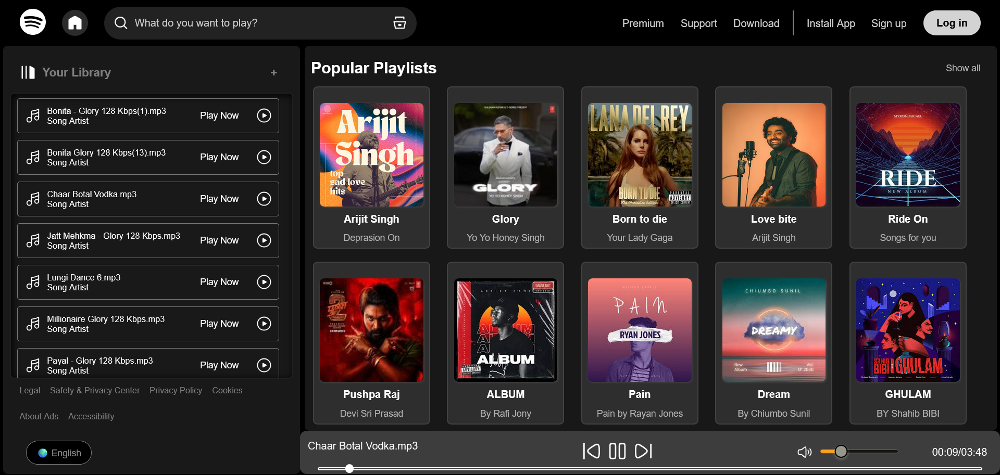

# 🎵 Spotify Clone (Basic)

This is a **basic Spotify-like music player** built using **HTML, CSS, and JavaScript (DOM Manipulation)**.  
It demonstrates my skills in **frontend development**, focusing on dynamic UI updates and audio handling with JavaScript.

---

## 🚀 Features

- 📂 **Album & Song Listing** – Detects songs from local folders.  
- ▶️ **Play / Pause Control** – Simple audio player with controls.  
- ⏮️ ⏭️ **Next / Previous Buttons** – Navigate through songs.  
- ⏱️ **Seekbar & Timer** – Real-time progress bar and time display.  
- 🔊 **Volume Control & Mute** – Adjust sound easily.  
- 📱 **Responsive UI** – Simple clean design using CSS only.  

---

## 🛠️ Tech Stack

- **HTML5** – Page structure  
- **CSS3** – Styling & layout  
- **JavaScript (DOM API)** – Logic for audio playback and dynamic playlists  

---

## 📂 How to Use Locally

1. **Clone the repository**  
   ```bash
   git clone https://github.com/<your-username>/spotify-clone.git
   cd spotify-clone
2. **Add your own songs**

- **Inside** - the project, go to the /songs folder.
- **Create** - subfolders (e.g., ncs, bollywood, english).
- **Place** - .mp3 files, cover.jpg, and info.json (optional) inside each subfolder.
- **Example** - structure:
  
  📂 songs
 ┣ 📂 img
 ┃ ┗ 📸 spotify.png
 ┣ 📂 ncs
 ┃ ┣ 🎵 song1.mp3
 ┃ ┣ 🎵 song2.mp3
 ┃ ┗ 📜 cover.jpg
 ┣ 📂 bollywood
 ┃ ┣ 🎵 track1.mp3
 ┃ ┗ 📜 cover.jpg

3. **Run the project**

- Open index.html in your browser
  OR
- Use a local server (recommended):
```bash
 npx serve
```
then open the given http://localhost:3000 in browser.

4. **Enjoy the music player!**

- Select an album → songs load automatically.
- Play/pause, skip next/previous, adjust volume, and seek progress.

**🎯 Learning Goals**

- Practice DOM manipulation with vanilla JavaScript.
- Learn the HTML5 Audio API.
- Strengthen skills in basic CSS layouts.
- Understand project structuring for music apps.

**📸 Preview**




**🙌 Notes**

This project is for learning and practice only.
It works best on local storage with your own songs.
Deployment on Vercel/GitHub Pages won’t auto-detect playlists (because folder listing is disabled).

```
Would you also like me to **add an example `songs/ncs/info.json` file** in the README so that anyone cloning can directly test without confusion?
```
